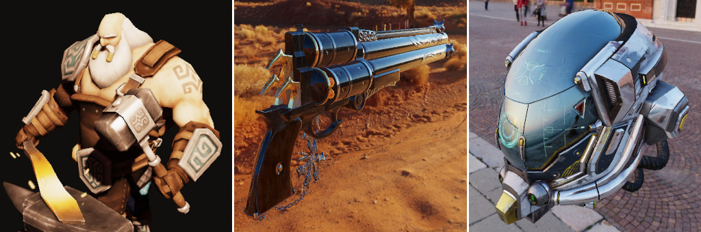

# Software Renderer

Software renderer written in c/c++ (SDL) for Windows that started from Casey Muratori's Handmade Hero Project https://handmadehero.org/.

Preview: https://www.deviantart.com/zoom-2x

## Features

* multithreading
* SSE vectorization
* tiled rendering
* perspective correct texture mapping
* texture filtering
* mipmapping + trilinear filtering
* tangent space normal mapping
* cubemapping
* depth buffer
* backface culling
* homogeneous clipping
* gamma correction
* tonemapping (clamp, reinhard, filmic (Uncharted 2), aproximated ACES)
* post processing (tint, saturation)
* directional light shadows (basic, linear, pcf3x3, pcf5x5)
* point light shadows (basic, linear, pcf (slower))
* transparency (separate buffer which holds up to 5 transparent samples per pixel)
* custom shader programs
* blinn-phong model
* physically based rendering + image based lighting model
* asset packing (bmp format with 4 channels, hdr equirectangular format (ibl), 3d gltf format)
* rudimentary custom memory management system

## Running the program

First of all you have to build the asset packages by running **run-asset-builder-msvc.bat** (select the "all" option). This will take a few minutes depending on your cpu. On mine (I5-2400) it takes between 5 to 10 minutes, the hdr texture packing is the biggest time comsumer. The packing step needs to be done once.

To change the level you want to run open the file **data/settings.json** and "uncomment" the desired level (remove the "1" in "level1"). Run **run-msvc.bat**.

## Building the program

First, you have to open the **shell.bat** and change the path to the MSVC **vcvarsall.bat** file and the path to the **software_renderer/shell** directory. Open a console and navigate to the **software_renderer** directory and run **shell** then **build** (the **shell** command needs to be run only once to setup the directories). This should generate the **executables** and the **dll** inside the **bin** directory.

The file **shell/build.bat** can be configured if needed.

The number of threads used can be changed in the file **src/gcsr_settings.h**, now the program uses 4 threads **#define GC_PIPE_NUM_THREADS 4**. On a I5-2400 3.1Ghz, a complex pbr hdr level runs at 5-20 fps on a 1280x800 resolution. I believe that on a newer processor, with more cores, the performance will be higher than this. You can also run a scene at a lower scaled resolution - this can be done by changing the **res_scaling** option inside the file **data/settings.json**, up to 4. This will boost the performance but the image will be pixelated, no filtering is being done when rescaling.

## Adding new assets

The input textures are in 32bit BMP format, 4 channels and the size needs to be a power of 2. The meshes need to be exported from Blender in gltf binary (.glb) format: 
* the first file (name.glb) will contain the base triangle mesh and has the following "Geometry" settings checked: Apply Modifiers, UVs, Normals, Tangents, Vertex Colors (for now this is not used)
* the second file (name.gen.glb) is used to extract the line and point meshes and has the following "Geometry" settings checked "Apply modifiers

The new assets need to be added in the file **data/package/asset_builder_config.json** - there are separate sections for each the textures and the meshes. Finally, run **run-asset-builder-msvc** and build only the packages corresponding to the new assets. Read the existing level files to see how they can be loaded.

## Dependencies

* MSVC compiler
* SDL https://www.libsdl.org/ (included)
* https://github.com/json-parser/json-parser (included)
* https://github.com/nothings/stb - for the hdr image loader (included)

## Assets used

* African head: https://github.com/ssloy/tinyrenderer
* Statue head: https://code.google.com/archive/p/msr-zbethel-tu
* Sponza: https://digitalwerk.artstation.com/projects/K5bEr
* Headscan: http://ir-ltd.net/infinite-3d-head-scan-released
* Cerberus: https://polycount.com/discussion/130641/cerberus-ffvii-gun-next-gen-asset-giveaway
* Chest: https://emackey.github.io/testing-pbr
* Craftsman: https://sketchfab.com/models/0e8ff87ffaa24731b2474badebca870d
* Helmet: https://sketchfab.com/models/b81008d513954189a063ff901f7abfe4 / https://github.com/KhronosGroup/glTF-Sample-Models/tree/master/2.0/DamagedHelmet
* Cyberpunk car: https://skfb.ly/6QUAI
* Wolf mask: https://skfb.ly/ooEBH
* Angry dragon: https://skfb.ly/6QWXF
* Drake pistol: https://skfb.ly/6xCGp

## Skybox textures and HDR textures:

* http://www.humus.name/index.php?page=Textures
* http://www.hdrlabs.com/sibl/archive.html
* https://polyhaven.com/a/venice_sunset
